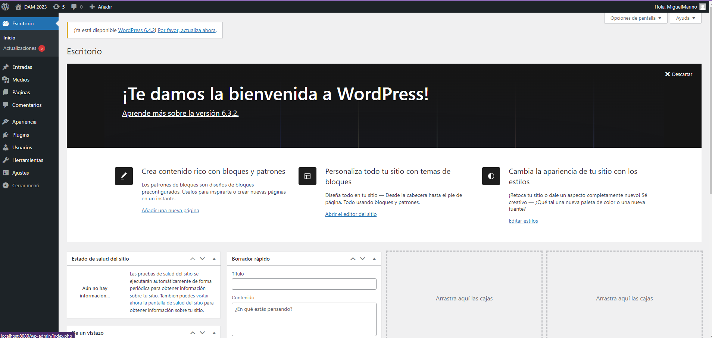
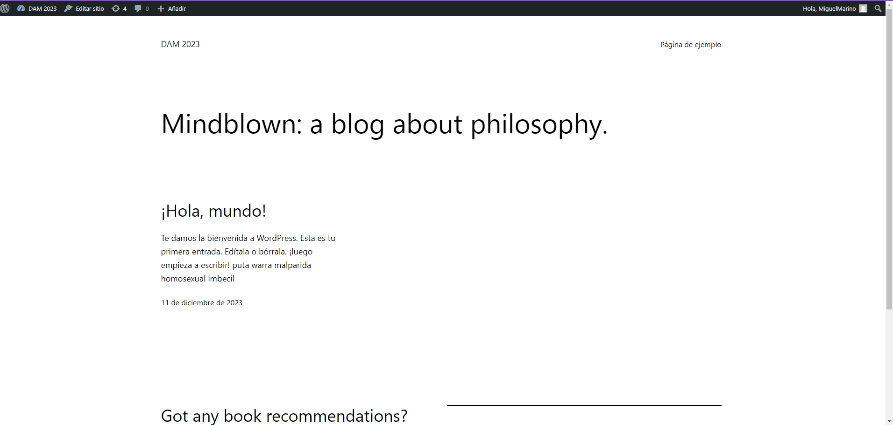

# Instalación de WordPress con Docker Compose

Este repositorio contiene un archivo de configuración de Docker Compose
para instalar WordPress con una base de datos MariaDB o MySQL. Sigue 
estos pasos para configurar tu entorno local.

## Pasos para la instalación

### Requisitos previos

Asegúrate de tener Docker y Docker Compose instalados en tu sistema.

### Pasos

1. Crea un nuevo proyecto con el nombre a tu elección pero con este nombre ``docker-compose.yml`` 


2. Copia el codigo en la pagina de [Docker Docs](https://docs.docker.com/samples/wordpress/#wordpress-samples), 
este es el codigo que yo use:

```yaml
services:
  db:
    # We use a mariadb image which supports both amd64 & arm64 architecture
    image: mariadb:10.6.4-focal
    # If you really want to use MySQL, uncomment the following line
    #image: mysql:8.0.27
    command: '--default-authentication-plugin=mysql_native_password'
    volumes:
      - ./db_data:/var/lib/mysql
    environment:
      - MYSQL_ROOT_PASSWORD=somewordpress
      - MYSQL_DATABASE=wordpress
      - MYSQL_USER=wordpress
      - MYSQL_PASSWORD=wordpress
    expose:
      - 3306
      - 33060
  wordpress:
    image: wordpress:latest
    volumes:
      - ./wp_data:/var/www/html
    ports:
      - 80:80
    environment:
      - WORDPRESS_DB_HOST=db
      - WORDPRESS_DB_USER=wordpress
      - WORDPRESS_DB_PASSWORD=wordpress
      - WORDPRESS_DB_NAME=wordpress
volumes:
  db_data:
  wp_data:
```


3. Edita el archivo `docker-compose.yml` para ajustar la configuración según tus preferencias:

    - **Servicio de la Base de Datos (db):**
        - `image`: Puedes seleccionar entre MariaDB (`mariadb:10.6.4-focal`) o MySQL (`mysql:8.0.27`). 
            Comenta o descomenta la línea según tu elección.
        - `command`: Establece el plugin de autenticación para MySQL si es necesario.
        - `volumes`: Define las rutas locales para almacenar los datos de la base de datos.
        - `environment`: Configura la contraseña y las credenciales para la base de datos.

    - **Servicio de WordPress:**
        - `image`: Utiliza la imagen más reciente de WordPress (`wordpress:latest`).
        - `volumes`: Define las rutas locales para almacenar los datos de WordPress.
        - `ports`: Asocia el puerto local (80 por defecto) al puerto de WordPress.

4. Ejecuta el contenedor usando Docker Compose:

    ```bash
    docker-compose up -d
    ```

5. Accede a WordPress en tu navegador:

   Visita `http://localhost` seguido de tu puerto y sigue las instrucciones para configurar WordPress.

## Parámetros del Archivo de Configuración (docker-compose.yml)

- `image`: Define la imagen del contenedor a utilizar para la base de datos y WordPress.
- `volumes`: Asocia directorios locales con ubicaciones dentro de los contenedores para almacenar datos.
- `environment`: Establece variables de entorno como contraseñas y credenciales de la base de datos.
- `ports`: Mapea puertos locales a puertos de los contenedores para acceder a WordPress.

## Al instalar todo y entrado estarias en esta pagina si todo fue bien



Y si ya llevas un tiempo con el y tienes entras y temas te apareceza al entrar segun tu tema y tal el mio es asi:


